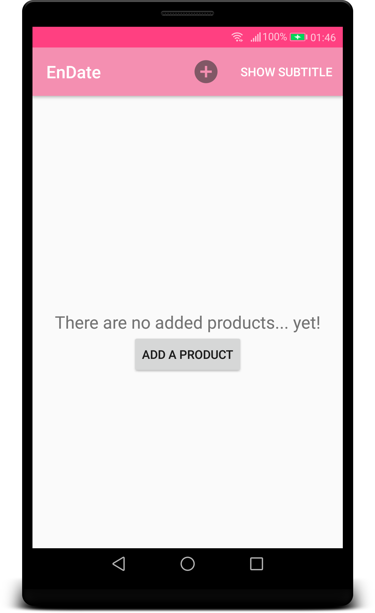
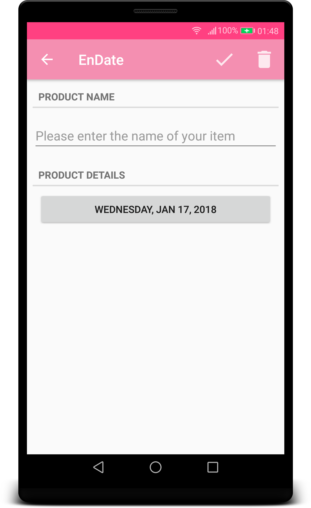
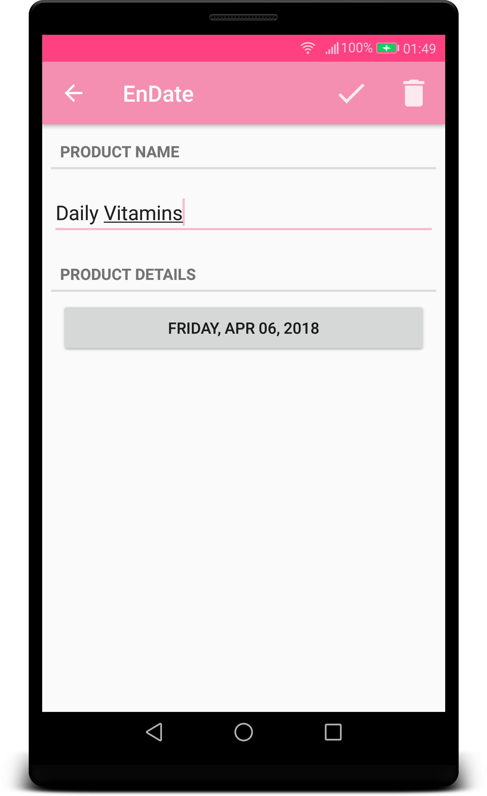
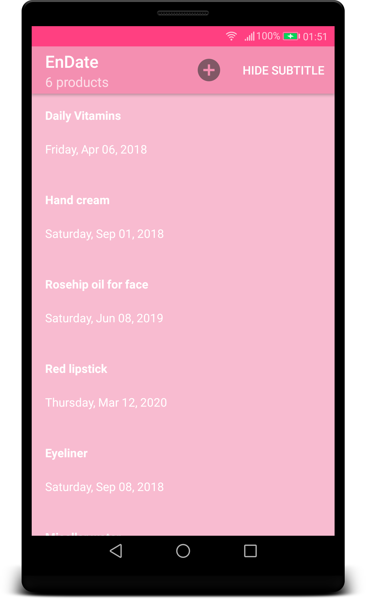

# EnDate App
Project developed for _Learn IT Girl_ mentorship program

## Project overview:

EnDate is an app for tracking expiration dates of products - make up, cosmetics, medicine.

People usually don't think about expiration dates when they start using new products. We throw the package right away and don't even bother to take notes about the date we bought or started using something. This could represent a big problem, since every product has a set date of expiration. If we continue to use expired products, we risk getting unwanted breakouts, redness, swelling, infections. This is especially dangerous for medicine.

EnDate allows users to keep track of the products they are using. 

You can find EnDate presentation >>> [HERE](https://docs.google.com/presentation/d/1sKBgKf5QJlrPlzrgwIbPBECHBAUP_DNgkk2EoaD7IBg/edit?usp=sharing)

## Features:

* User can add a new product to the list
* When adding a new product, user enters its name and picks expiration date from a calendar
* List items can be edited or deleted
* User is able to swipe between the items (once the detail view is open)
* By pressing the Show Subtitle menu option, user can see the total number of items, writen below the app's title

## Empty screen
* When the list is empty, user can add a new item by tapping on the button in the centre of the screen

## Detail view
* To add a new item, user enters name and selects the date by tapping the button that opens Date picker

## List with shown counter
* User can tap on Show/Hide subtitle menu button to reveal list item counter below the app's title

